# DO2_LinuxNetwork-1 Report

## Part 1. Инструмент ipcalc

#### 1.1. Сети и маски

- адрес сети указан в поле _Network_: *192.167.38.54/13*

    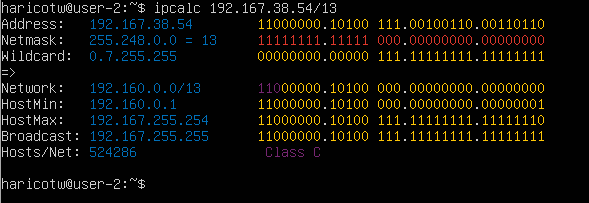

- перевод масок
    - *255.255.255.0* в префиксную и двоичную записи

    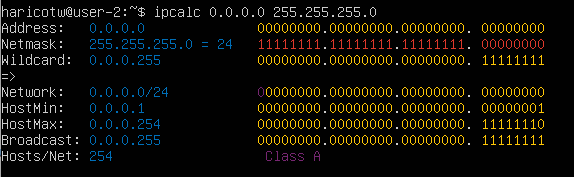

        В префиксной: 24
        В двоичной: 	11111111.11111111.11111111.00000000

    - */15* в обычную и двоичную записи

    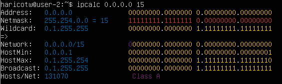

        В обычной: 255.254.0.0
        В двоичной: 11111111.11111110.00000000.00000000

    - *11111111.11111111.11111111.11110000* в обычную и префиксную записи
    
    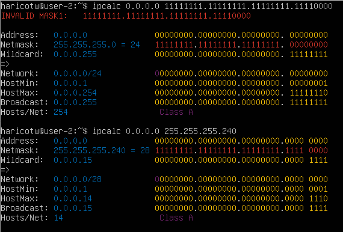

        Поскольку двоичную форму адреса в качестве входных данных указать нельзя, переводим двоичную запись в десятичную 255.255.255.240
        В обычной: 255.255.255.240
        В префиксной: 28

- минимальный и максимальный хост в сети *12.167.38.4* при масках:

    - */8*

    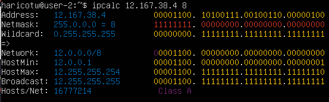

        Минимальный хост: 12.0.0.1
        Максимальный хост: 12.255.255.254

    - *11111111.11111111.00000000.00000000*

    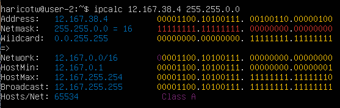

        Поскольку двоичную форму адреса в качестве входных данных указать нельзя, переводим двоичную запись в десятичную 255.255.0.0
        Минимальный хост: 12.167.0.1
        Максимальный хост: 12.167.255.254

    - *255.255.254.0*

    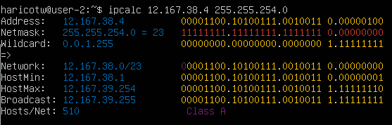

        Минимальный хост: 12.167.38.1
        Максимальный хост: 12.167.39.254

    - */4*

    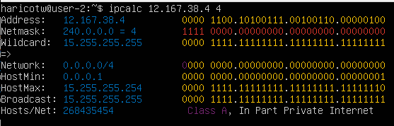

        Минимальный хост: 0.0.0.1
        Максимальный хост: 15.255.255.254
    
#### 1.2. localhost

- Обратная петля _**loopback**_ позволяет компьютеру связываться с самим собой, используя протоколы сетевых подключений.

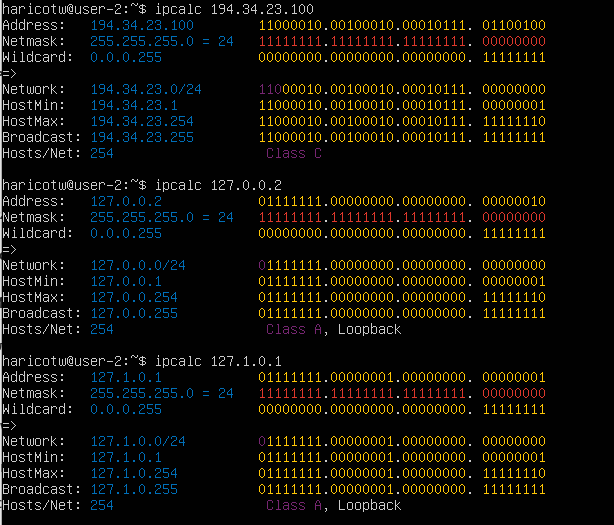
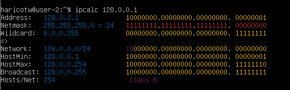

        Можно ли обратиться к приложению, работающему на localhost, со следующими IP:
            194.34.23.100 - нет
            127.0.0.2 - да
            127.1.0.1 - да
            128.0.0.1 - нет

#### 1.3. Диапазоны и сегменты сетей

- Определение публичных и частных IP

        К частным "серым" адресам относятся IP-адреса из следующих подсетей:

        От 10.0.0.0 до 10.255.255.255 с маской 255.0.0.0 или /8
        От 172.16.0.0 до 172.31.255.255 с маской 255.240.0.0 или /12
        От 192.168.0.0 до 192.168.255.255 с маской 255.255.0.0 или /16
        От 100.64.0.0 до 100.127.255.255 с маской подсети 255.192.0.0 или /10; 

    
    - **Частные**: *10.0.0.45*, *192.168.4.2*, *172.20.250.4*, *172.16.255.255*, *10.10.10.10*
    
    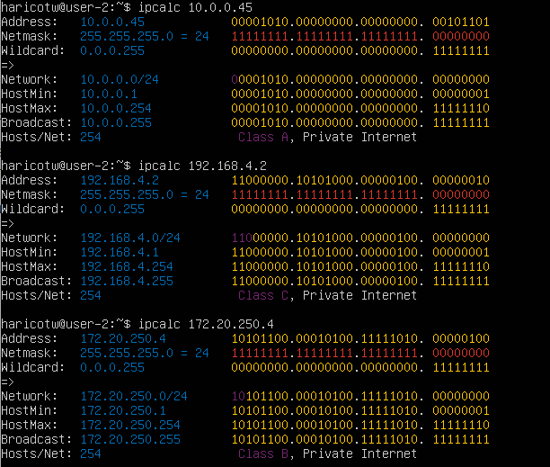
    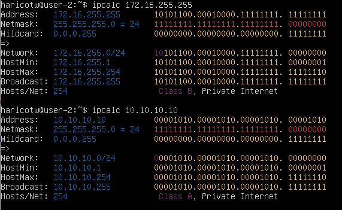

    - **Публичные**: *134.43.0.2*, *172.0.2.1*, *192.172.0.1*, *172.68.0.2*, *192.169.168.1*

    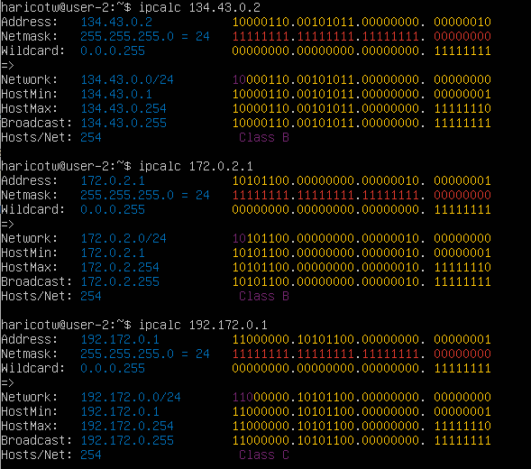
    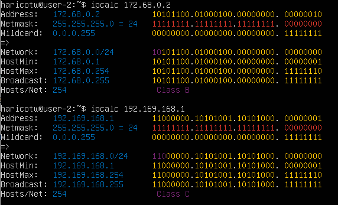

- Определение возможных IP адресов шлюза возможны сети *10.10.0.0/18*

    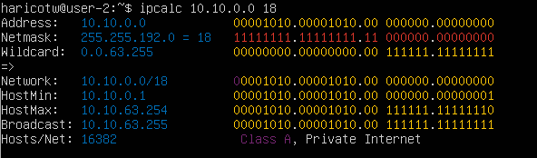

        Диапазон возможных IP-адресов: 10.0.0.1 - 10.10.63.254

    - Возможные адреса: *10.0.0.1*, *10.10.0.2*, *10.10.10.10*
    - Невозможные адреса: *10.10.100.1*, *10.10.1.255*

## Part 2. Статическая маршрутизация между двумя машинами

- С помощью команды `ip a` узнаем существующие сетевые интерфейсы

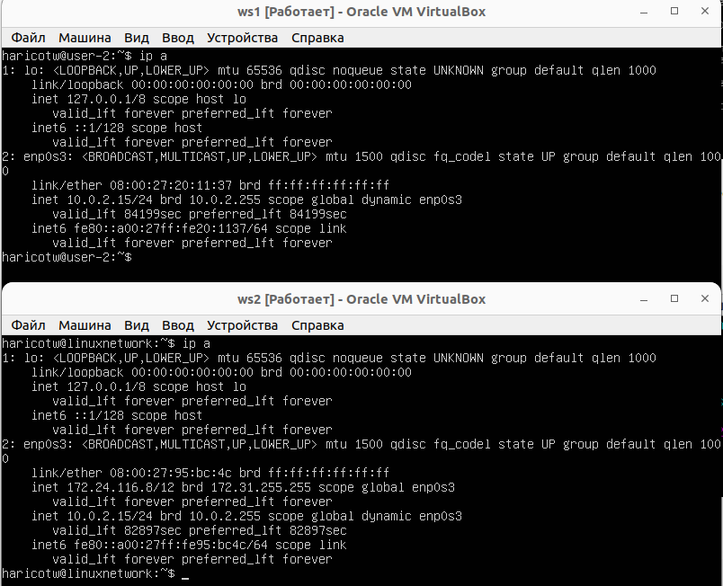

- Опишем сетевой интерфейс, соответствующий внутренней сети. Зададим следующие адреса и маски: 
    - ws1: *192.168.100.10*, маска */16*
    - ws2: *172.24.116.8*, маска */12*

- Применяем конфигурацию с помощью команды: `sudo netplan apply`

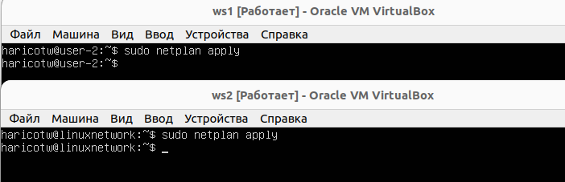

#### 2.1. Добавление статического маршрута вручную

- Добавим статический маршрут вручную с помощью команды `ip r add` 

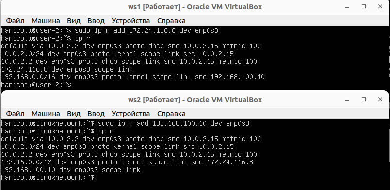

- Пропингуем соединение между машинами

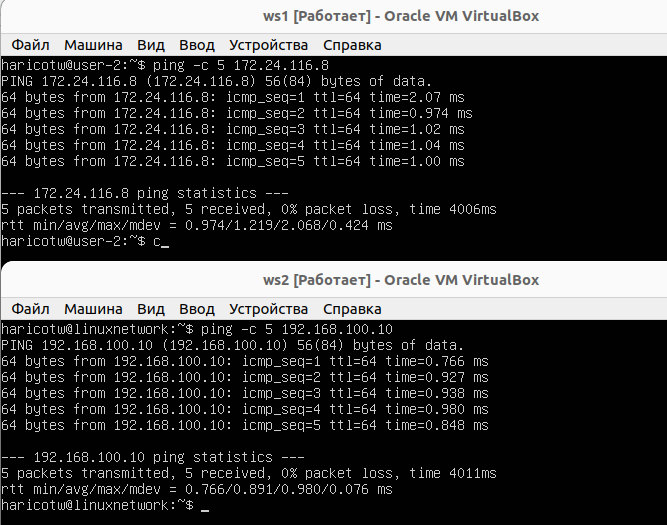

#### 2.2. Добавление статического маршрута с сохранением

- Перезапустим машины с помощью `sudo reboot`

- Проверим, что после перезапуска статические маршруты были удалены

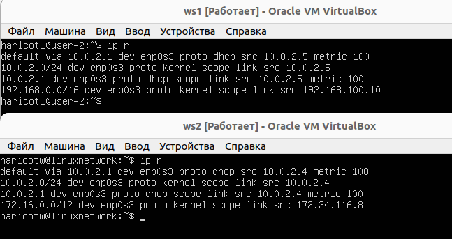

- Добавим статический маршрут от одной машины до другой с помощью файла etc/netplan/00-installer-config.yaml

- Проверим, что изменения в файле сохранены, и применим новую конфигурацию с помощью `sudo netplan apply`
- C помощью `ip r` убедимся, что маршруты добавлены

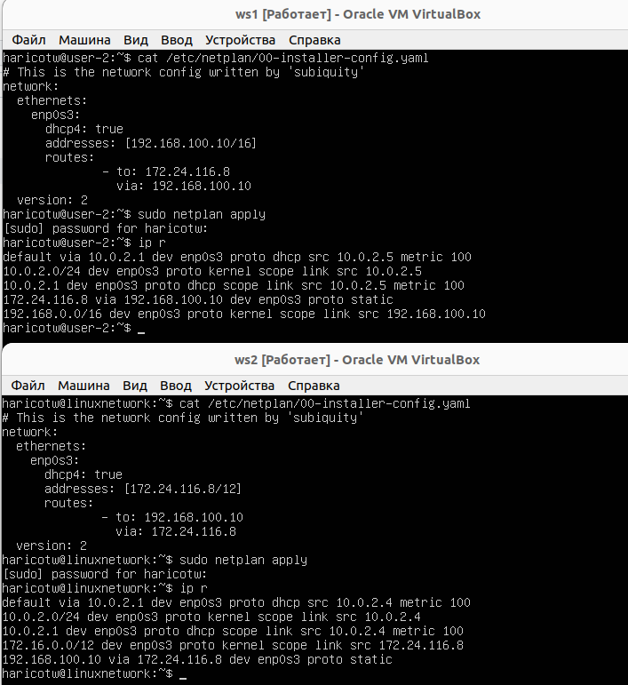

- Пропингуем соединение между машинами

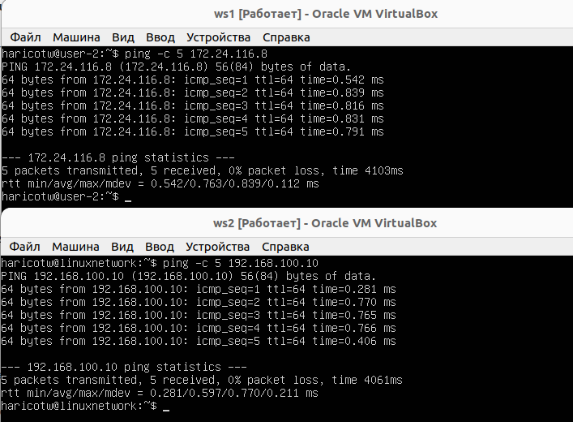

## Part 3. Утилита **iperf3**

#### 3.1. Скорость соединения

- Перевод

| Исходное | Перевод | Пояснение |
| ------ | ------ | ------ |
| 8 Mbps | 1 MB/s |1 MB = 8 Mb|
| 100 MB/s | 800000 Kbps |1 MB = 8 * 10^3 Kb|
|1 Gbps|1000 Mbps|1 Gb = 10^3 Mb|

#### 3.2. Утилита **iperf3**

- Измерим скорость соединения между ws1 и ws2

- Сначала необходимо запустить серверную часть программы. Для этого выполним на _ws1_ `iperf3 -s`. Таким образом, был запущен сервер с адресом _192.168.100.10_

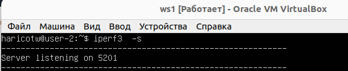

- Подключимся к серверу с помощью `iperf3 -c 192.168.100.10` и получим информацию о скорости подключения

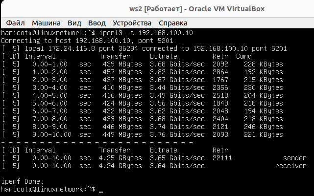

- Скорость передачи для sender (ws1): 3.65 Gbps
- Скорость передачи receiver (ws2): 3.64 Gbps

## Part 4. Сетевой экран

#### 4.1. Утилита **iptables**

- Создадим файл */etc/firewall.sh* и применим следующие правила

1. на ws1 применить стратегию когда в начале пишется запрещающее правило, а в конце пишется разрешающее правило (это касается пунктов 4 и 5)
2. на ws2 применить стратегию когда в начале пишется разрешающее правило, а в конце пишется запрещающее правило (это касается пунктов 4 и 5)
3. открыть на машинах доступ для порта 22 (ssh) и порта 80 (http)
4. запретить *echo reply* (машина не должна "пинговаться”, т.е. должна быть блокировка на OUTPUT)
5. разрешить *echo reply* (машина должна "пинговаться")

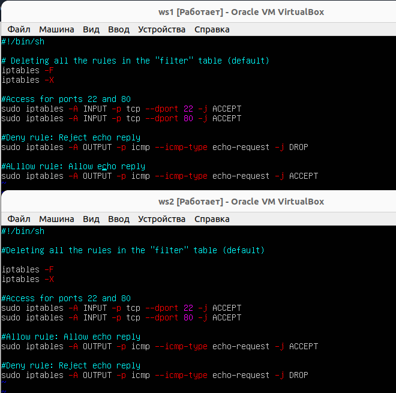

- Запустим файлы на обеих машинах командами `chmod +x /etc/firewall.sh` и `/etc/firewall.sh`
- С помощью `iptables -L` рассмотрим, как выполняется просмотр правил

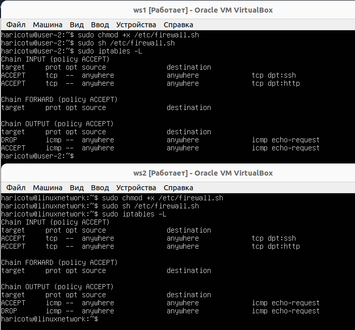

- Опишем разницу между стратегиями, применёнными в первом и втором файлах
> При создании файлов /etc/firewall.sh была использована опция  
_-j - выбрать действие, если правило подошло_  
 Таким образом, при обработке правил сверху-вниз при совпадении описанных условий применяется то правило, что расположено выше. Из-за того, что в файле ws1 запрещающее правило находится выше разрешающего, виртуальная машина 1 не может пропинговать виртуальную машину 2. Для виртуальной машины 2 ситуация противоположная, поскольку разрешающее правило выше запрещающего

#### 4.2. Утилита **nmap**
- Командой **ping** проверим, что машина _ws1_ не "пингуется"

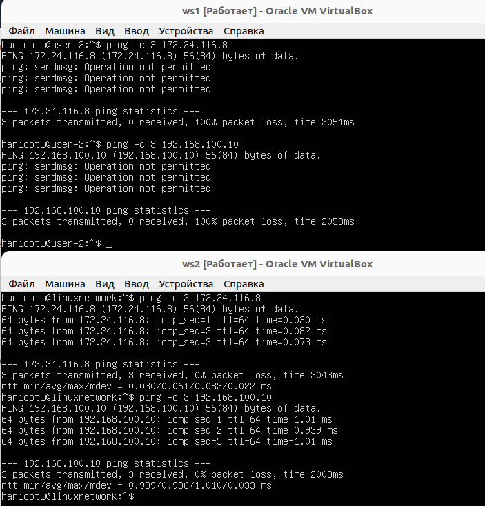

> Поскольку на _ws1_ задана блокировка на OUTPUT, PING с нее невозможен, что видно по верхней части скриншота. В то же время ws2 пингуется без проблем

- С помощью утилитой **nmap** посмотрим, что хосты машин запущены

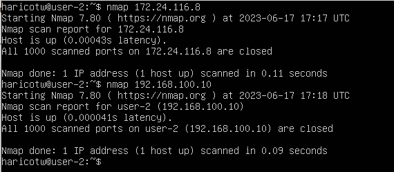

## Part 5. Статическая маршрутизация сети

- Поднимем пять виртуальных машин (3 рабочие станции (ws11, ws21, ws22) и 2 роутера (r1, r2))

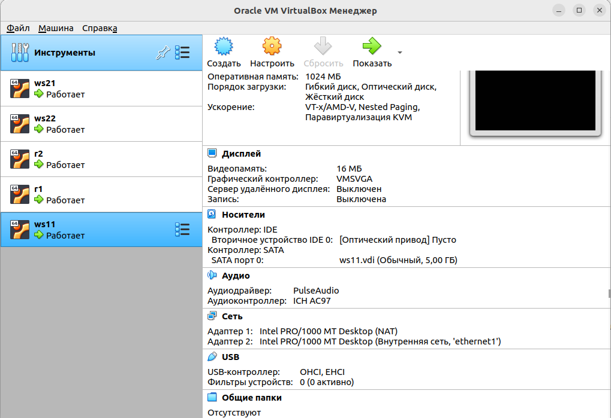

#### 5.1. Настройка адресов машин

- В настройках Virtualbox меняем типы соединения:
    - ws11, ws21, ws21:  
        **Адаптер 1** - NAT  
        **Адаптер 2** -  Внутренняя сеть   
    - r1, r2:  
        **Адаптер1** - NAT  
        **Адаптер 2** - Внутренняя сеть  
        **Адаптер 3** - Внутренняя сеть   

- Благодаря этому у машин появятся новые интерфейсы, которые можно настроить в соответствии со схемой. Настроим конфигурации машин в *etc/netplan/00-installer-config.yaml*

- Изменим конфигурацию рабочих станций _ws11_, _ws21_, _ws22_

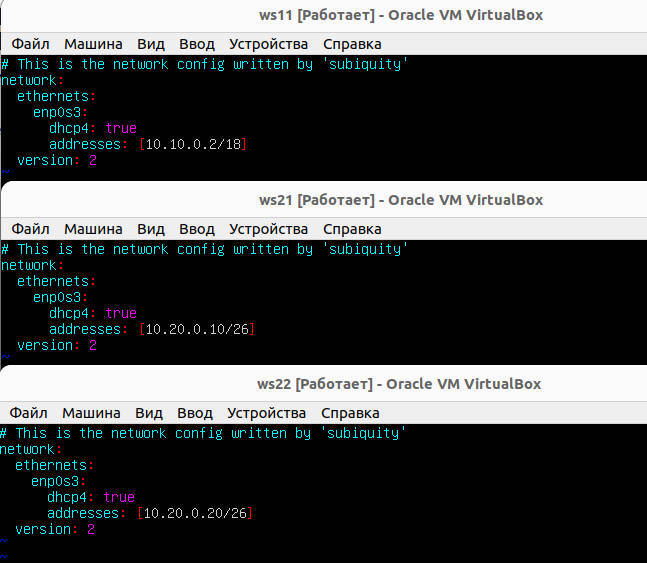

- Изменим конфигурацию роутеров _r1_, _r2_

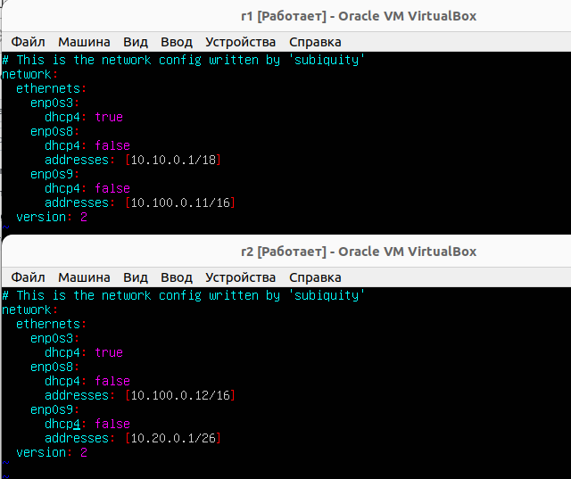

- Перезапустим сервис сети с помощбю `sudo netplan apply`. Командой `ip -4 a` проверим, что адрес машины задан верно

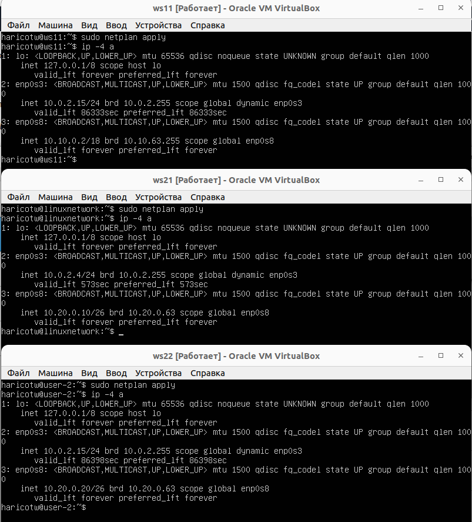

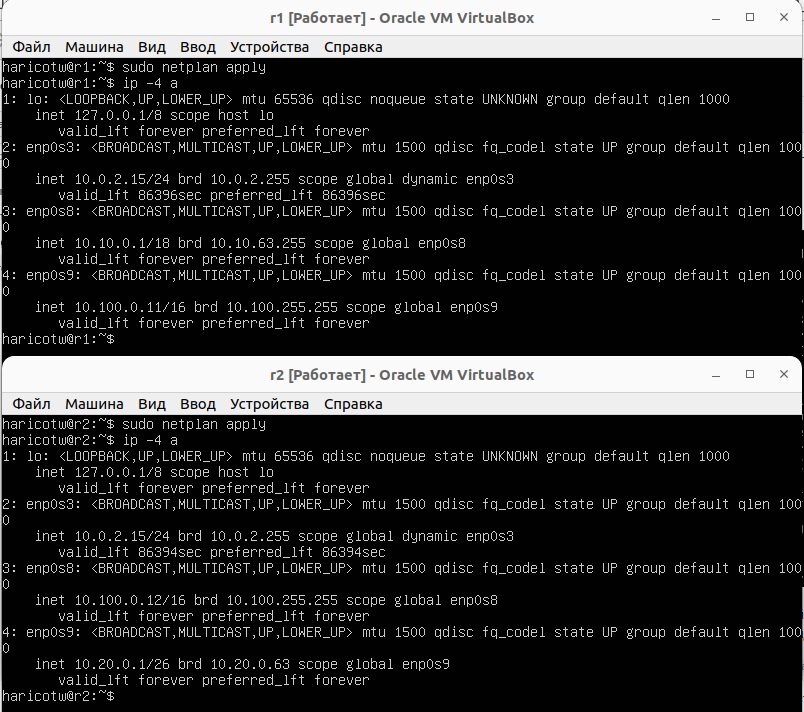

- Пропингуем ws22 с ws21

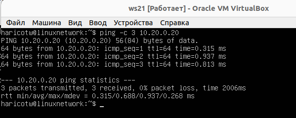

- Пропингуем r1 с ws11

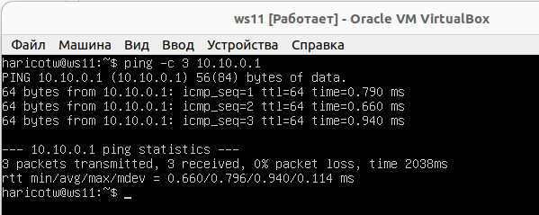

#### 5.2. Включение переадресации IP-адресов

- Для включения переадресации IP, выполним команду на роутерах: `sysctl -w net.ipv4.ip_forward=1`

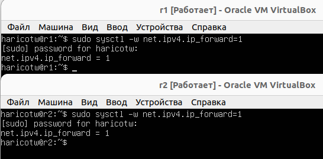

> Переадресация не будет работать после перезагрузки системы

- Для включения переадресации на постоянной основе, в файле */etc/sysctl.conf* раскомментируем следующую строку: `net.ipv4.ip_forward = 1`

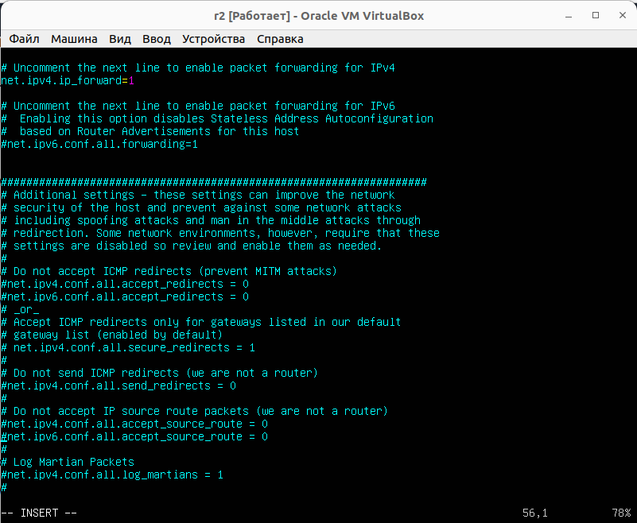

> IP-переадресация включена на постоянной основе

#### 5.3. Установка маршрута по-умолчанию

- Настроим маршрут по-умолчанию (шлюз) для рабочих станций. Для этого добавим `default` перед IP роутера в файле конфигураций *etc/netplan/00-installer-config.yaml*

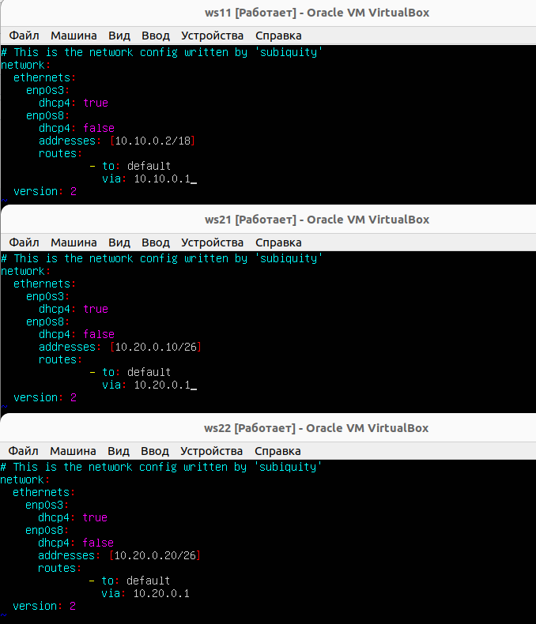

- Примем изменения с помощью` sudo netplan apply`
- Просмотрим с помощью `ip r`, что маршрут был добавлен в таблицу маршрутизации. Первая строчка с _default_ соответсвует добавленным маршрутам

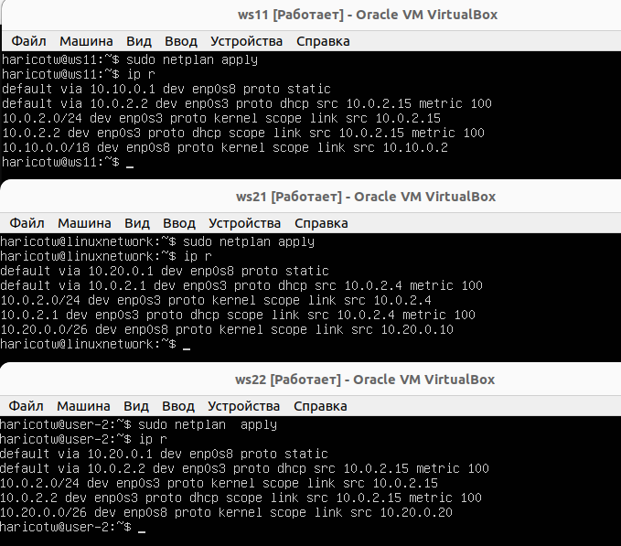

- Узнаем, какие девайсы можно прослушать с r2 с помощью `tcdump -D`

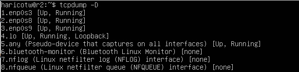

- Пропингуем с ws11 роутер r2

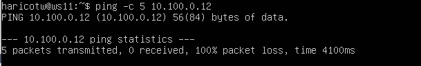

- Покажем на r2, что пинг доходит. Для этого прослушиваем интерфейс _enp0s8_

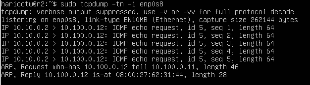

> Таким образом, пинг с ws11 доходит до r2, но поскольку роутеру неизвестно, куда возвращать пакеты, они не возвращаются назад, о чем сообщает результаты команды "0 received, 100% lost"

#### 5.4. Добавление статических маршрутов

- Добавим в роутеры r1 и r2 статические маршруты в файле конфигураций

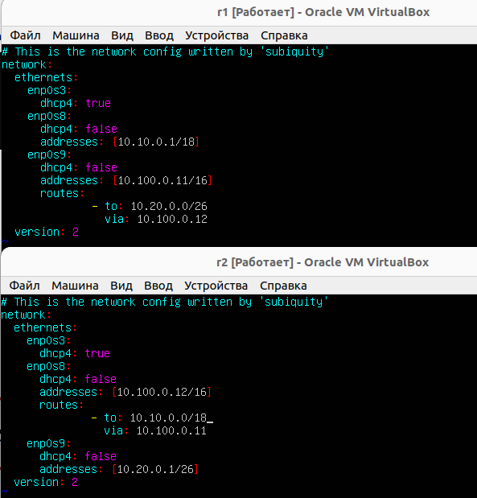

- Примем изменения конфигурации: `sudo netplan apply`
- Покажем таблицы с маршрутами с помощью `ip r`

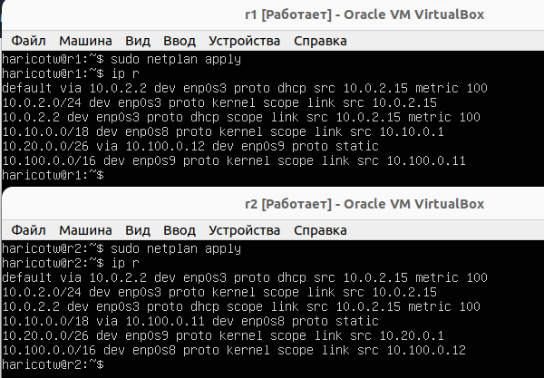

    - r1: 10.20.0.0/26 via 10.100.0.12 (2 строка снизу)
    - r2: 10.10.0.0/18 via 10.100.0.11 (3 строка снизу)

- Запустим команды на ws11: `ip r list 10.10.0.0/[маска сети]` и `ip r list 0.0.0.0/0`

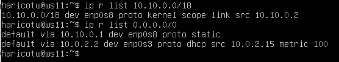

> Для адреса _10.10.0.0/18_ не был выбран маршрут _0.0.0.0/0_, потому что пакеты  отправляется на него только тогда, когда другой маршрут не задан явным образом в таблице маршрутизации хоста. Так как _ws11_ находится внутри сети 10.10.0.0/18, то для связи с ней она использует свой IP-адрес _10.10.0.2_. Адрес _0.0.0.0/0_ находится в другой сети, поэтому ws1 отправляет данные на роутер, используя маршрут по умолчанию, прописанный в файле конфигурации (10.10.0.1)

#### 5.5. Построение списка маршрутизаторов

- Запустим на r1 команду дампа: `tcpdump -tnv -i _enp0s8_`

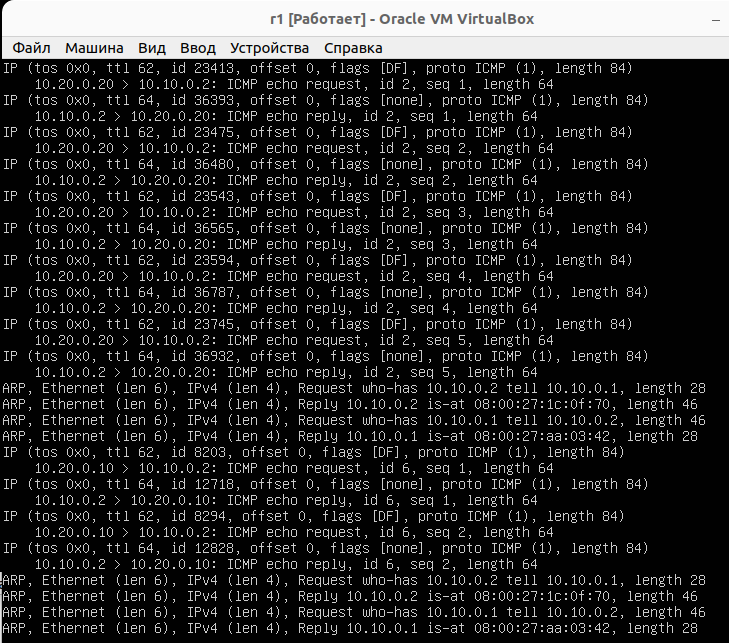

- При помощи утилиты traceroute построим список маршрутизаторов на пути от _ws11_ до _ws21_

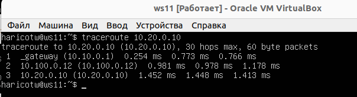

> Из дампа на r1 видно, что пакет проходит через маршрутизаторы для достижения указанного адреса. На этом основан принцип работы traceroute.   
Каждый пакет проходит на своем пути определенное количество узлов, пока достигнет своей цели. Причем, каждый пакет имеет свое время жизни. Это количество узлов, которые может пройти пакет перед тем, как он будет уничтожен. Этот параметр записывается в заголовке TTL, каждый маршрутизатор, через который будет проходить пакет уменьшает его на единицу. При TTL=0 пакет уничтожается, а отправителю отсылается сообщение Time Exceeded.   
Команда traceroute linux использует UDP пакеты. Она отправляет пакет с TTL=1 и смотрит адрес ответившего узла, дальше TTL=2, TTL=3 и так пока не достигнет цели. Каждый раз отправляется по три пакета и для каждого из них измеряется время прохождения. Пакет отправляется на случайный порт, который, скорее всего, не занят. Когда утилита traceroute получает сообщение от целевого узла о том, что порт недоступен трассировка считается завершенной.

#### 5.6. Использование протокола **ICMP** при маршрутизации

> **_ICMP_** (англ. Internet Control Message Protocol — протокол межсетевых управляющих сообщений[1]) — сетевой протокол, входящий в стек протоколов TCP/IP. В основном ICMP используется для передачи сообщений об ошибках и других исключительных ситуациях, возникших при передаче данных

- Запустим на r1 команду: `tcpdump -n -i enp0s8 icmp`

- Пропингуем с ws11 несуществующий IP с помощью команды: `ping -c 1 10.30.0.111`

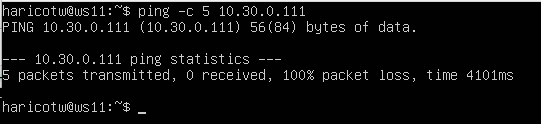

- Отследим перехват сетевого трафика, проходящего через _enp0s8_ на r1

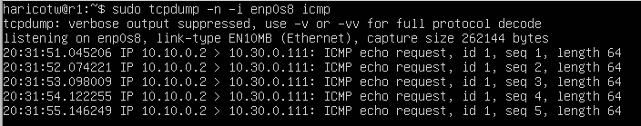

> Таким образом, пакеты, отправителенные на 10.30.0.111, проходят через путь по-умолчанию через роутер r1

## Part 6. Динамическая настройка IP с помощью **DHCP**

- Для работы с протоколом DHCP сначала надо установим утилиту на r2: `sudo apt-get install isc-dhcp-server`

- Для r2 настроим в файле /etc/dhcp/dhcpd.conf конфигурацию службы DHCP

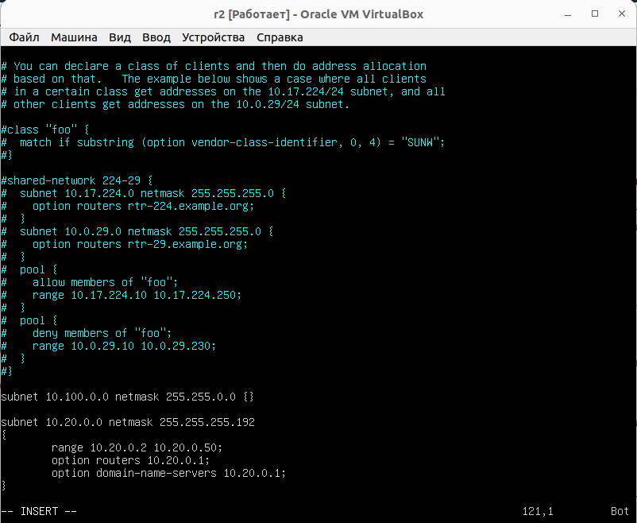

- В файле *resolv.conf* пропишем `nameserver 8.8.8.8.`

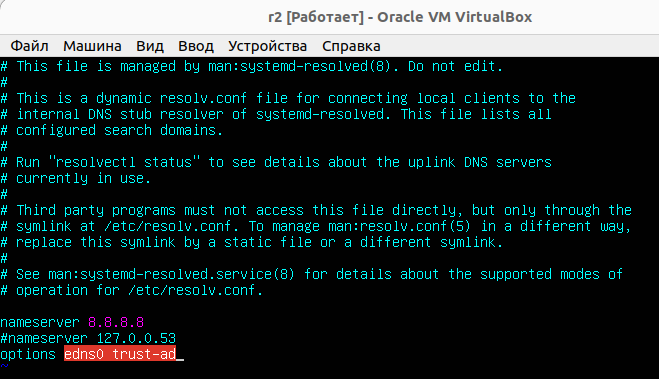

- Перезагрузим службу **DHCP** командой `systemctl restart isc-dhcp-server`

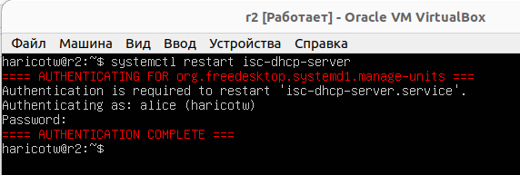

- Посольку в сети появился DHCP-сервер, в файле конфигурации `etc/netplan/00-installer-config.yaml` изменим `dhcp: true`

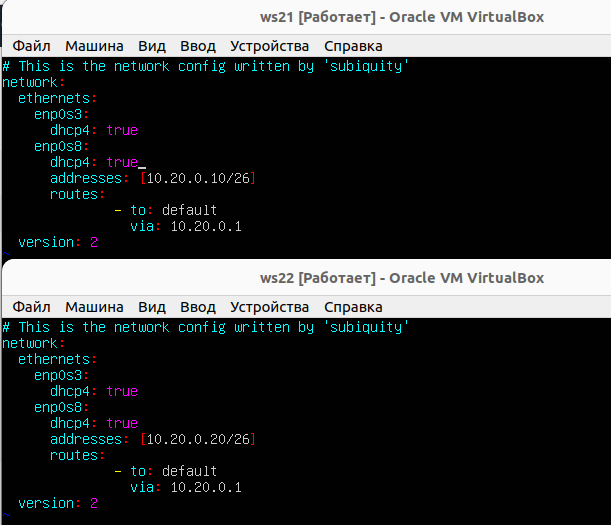

- Примем изменения `sudo netplan apply`

- Машину ws21 перезагрузим при помощи `reboot`

- Через `ip a` показажем, что ws21 получила адрес. 

> Видим, что ws21 получила динамический IP-адрес 10.20.0.2/26

- Пропингуем ws22 с ws21

##### Указать MAC адрес у ws11, r1 настроить аналогично r2 с выдачей адресов с жесткой привязкой к MAC-адресу 

- Указать MAC адрес у ws11, для этого в *etc/netplan/00-installer-config.yaml* надо добавить строки: `macaddress: 10:10:10:10:10:BA`, `dhcp4: true`

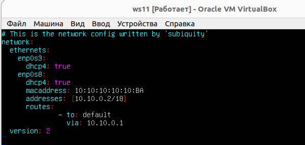

- Принимаем изменения: `sudo netplan apply`

- Также выключаем вм и в настройках сети указываем MAC-адрес

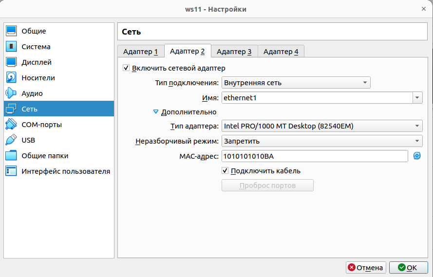

- Для работы с протоколом DHCP сначала надо установим утилиту на r1: `sudo apt-get install isc-dhcp-server`

- Для r1 настроим в файле /etc/dhcp/dhcpd.conf конфигурацию службы DHCP

- В файле *resolv.conf* пропишем `nameserver 8.8.8.8.`

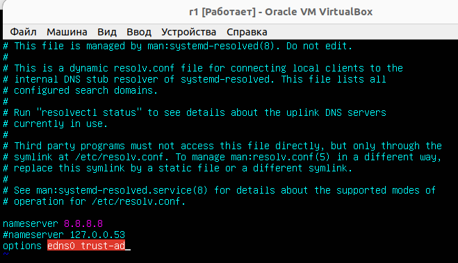

- Перезагрузим службу **DHCP** командой `systemctl restart isc-dhcp-server`

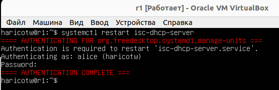

- Машину ws11 перезагрузим при помощи `reboot`

- Через `ip a` показажем, что ws11 получила mac-адрес

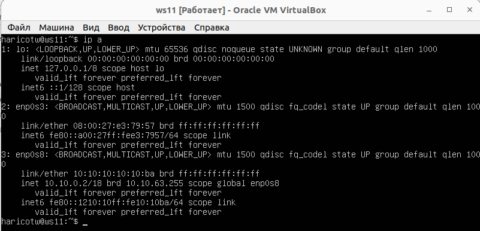

- Пропингуем ws11 с ws21

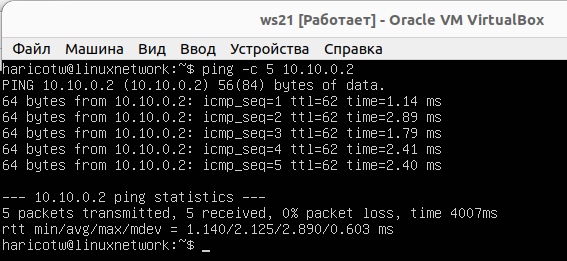

##### Запросить с ws21 обновление ip адреса

- Выполним `ip a` до обновления адреса

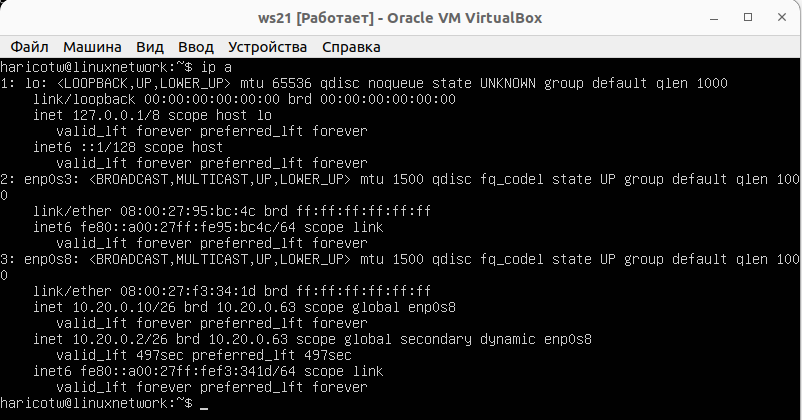

- Запросим с ws21 обновление ip адреса. Для этого выполняем
    - `sudo dhclient -r enp0s8` (-r означает освободить IP-адрес)
    - `sudo dhclient`

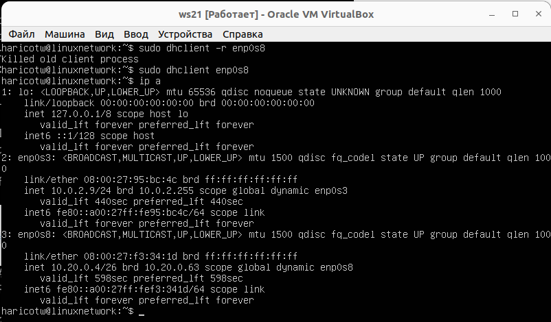

## Part 7. **NAT**

- В файле */etc/apache2/ports.conf* на ws22 и r1 изменим строку `Listen 80` на `Listen 0.0.0.0:80` (сделаем сервер Apache2 общедоступным)

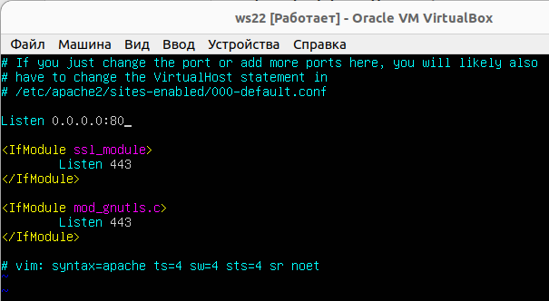

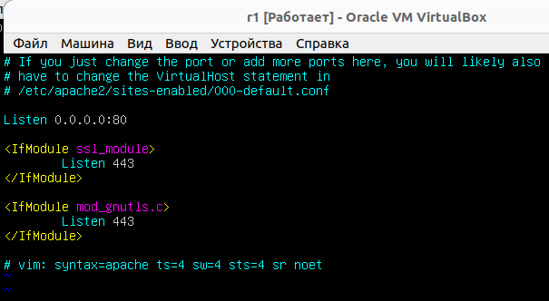

- Запустим веб-сервер Apache командой `service apache2 start` на ws22 и r1

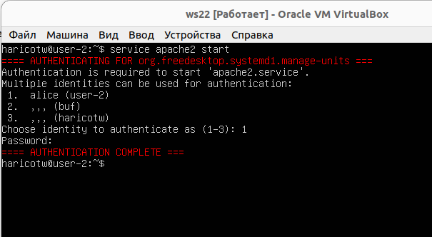

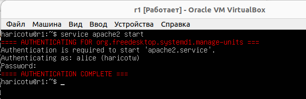

##### Добавить в фаервол, созданный по аналогии с фаерволом из Части 4, на r2 следующие правила:
###### 1) удаление правил в таблице filter - `iptables -F`
###### 2) удаление правил в таблице "NAT" - `iptables -F -t nat`
###### 3) отбрасывать все маршрутизируемые пакеты - `iptables --policy FORWARD DROP`

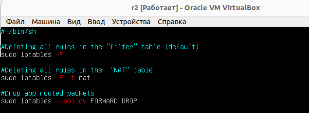

- Запустим файл командами `chmod +x /etc/firewall.sh` и `/etc/firewall.sh`

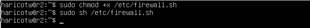

- Проверим соединение между ws22 и r1 командой `ping`

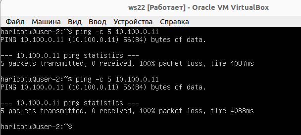

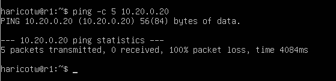

> _FORWARD_ используется для обработки предназначенного для других серверов трафика, который не был создан на данном сервере. Эта цепочка в основном необходима для маршрутизации запросов на другие серверы.  
Поэтому при правиле FORWARD DROP ws22 не "пингуется" с r1

##### Добавить в файл ещё одно правило:
###### 4) разрешить маршрутизацию всех пакетов протокола **ICMP**

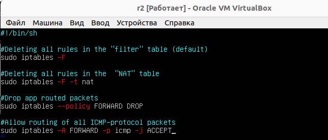

- Запустим файл командами `chmod +x /etc/firewall.sh` и `/etc/firewall.sh`
- С помощью `iptables -L` рассмотрим, как выполняется просмотр правил

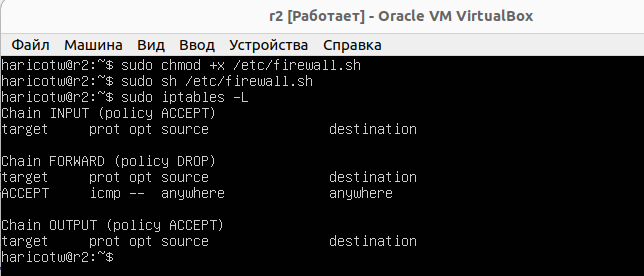

- Проверим соединение между ws22 и r1 командой `ping`

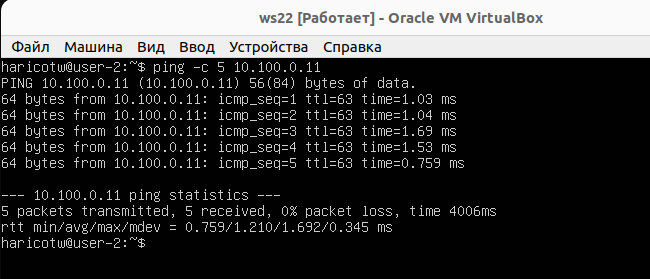

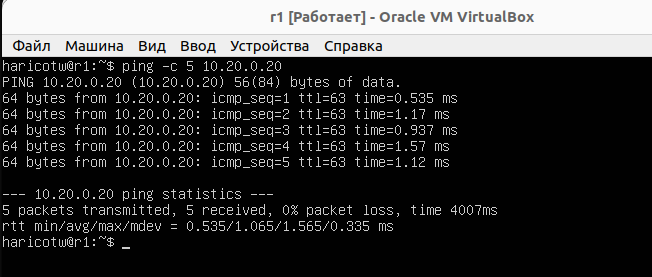

> ws22 не должна "пингуется" с r1

##### Добавить в файл ещё два правила:

###### 5) включить **SNAT**, а именно маскирование всех локальных ip из локальной сети, находящейся за r2 (по обозначениям из Части 5 - сеть 10.20.0.0)
###### 6) включить **DNAT** на 8080 порт машины r2 и добавить к веб-серверу Apache, запущенному на ws22, доступ извне сети

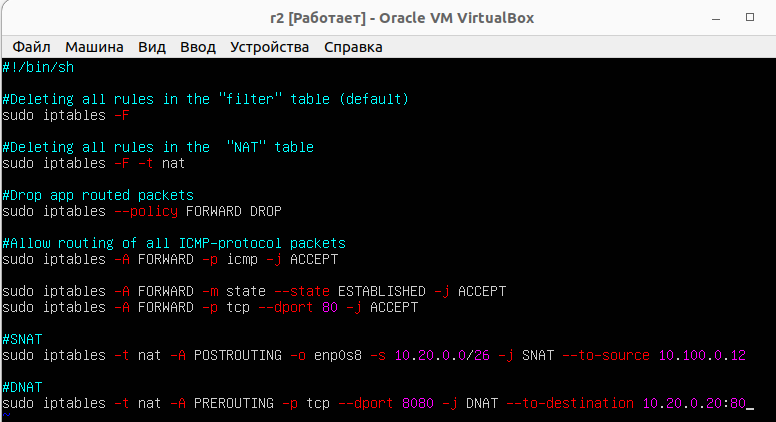

- t - указывает на используемую таблицу
- p - указывает протокол (tcp, udp, udplite)
- s - указывает адрес источника пакета
- d - указывает адрес назначения пакета 
- i - задает входящий сетевой интерфейс;
- o - указывает исходящий сетевой интерфейс;
> _DNAT_ — подменяет адрес получателя в заголовке IP-пакета, основное применение — предоставление доступа к сервисам снаружи, находящимся внутри сети  
_SNAT_ — служит для преобразования сетевых адресов, применимо, когда за сервером находятся машины, которым необходимо предоставить доступ в Интернет, при этом от провайдера имеется статический IP-адрес

- Запустим файл командами `chmod +x /etc/firewall.sh` и `/etc/firewall.sh`

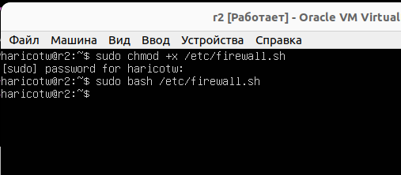

##### Проверить соединение по TCP для **SNAT**

- В настройках Virtualbox отключим сетевой интерфейс **NAT**

- Проверим соединение по TCP для **SNAT**. Подключимся к серверу Apache с ws22 на r1 командой: `telnet [адрес] [порт]`

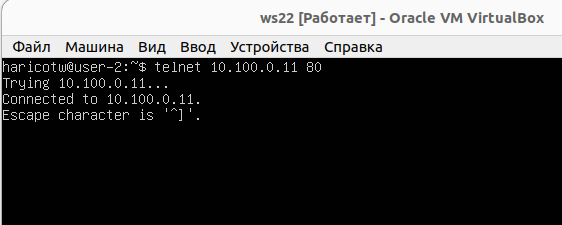

##### Проверить соединение по TCP для **DNAT**

- С r1 подключимся к серверу Apache на ws22 командой `telnet` (обращаться по адресу r2 и порту 8080)

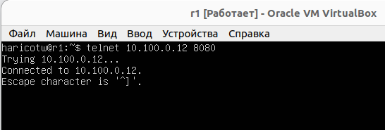

## Part 8. Дополнительно. Знакомство с **SSH Tunnels**

- Запустим на r2 фаервол с правилами из Части 7

- В файле /etc/apache2/ports.conf изменим строку `Listen 80` на `Listen localhost:80`

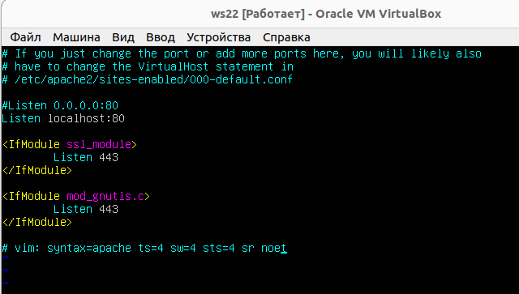

- Запустим веб-сервер **Apache** на ws22 только на localhost

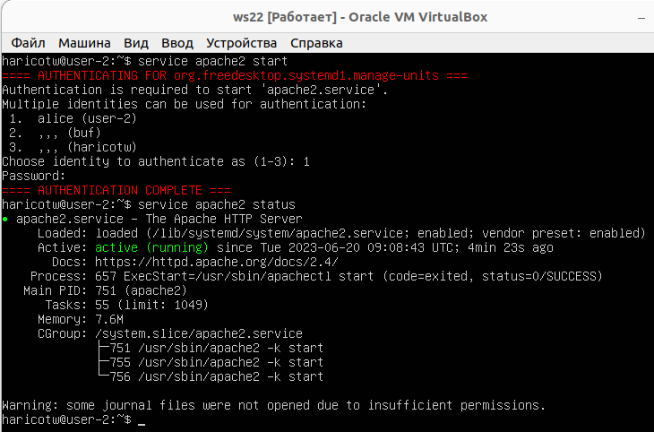

#### Воспользоваться Local TCP forwarding с ws21 до ws22, чтобы получить доступ к веб-серверу на ws22 с ws21

- Воспользуемся Local TCP forwarding с ws21 до ws22

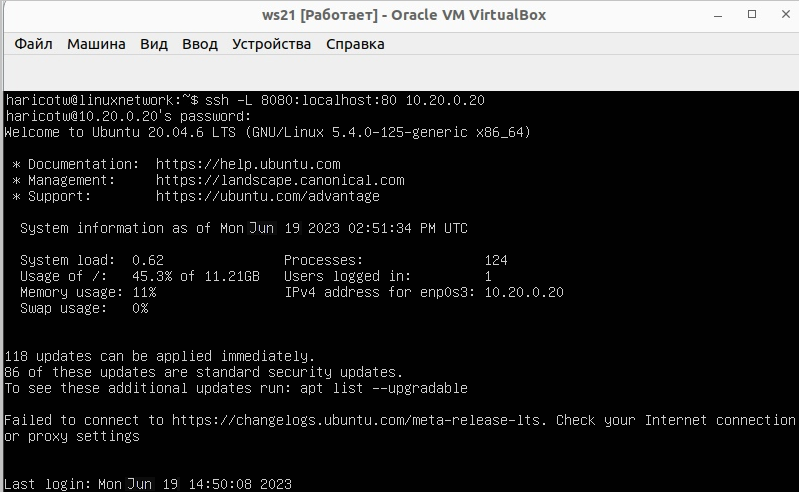

- Для проверки подключения перейдем во второй терминал и выполним команду: `telnet 127.0.0.1 [локальный порт]`

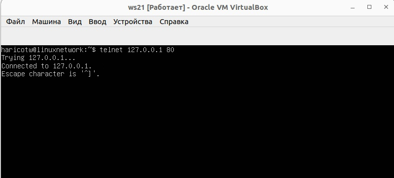

#### Воспользоваться Remote TCP forwarding c ws11 до ws22, чтобы получить доступ к веб-серверу на ws22 с ws11

- Воспользуемся Remote TCP forwarding с ws21 до ws22

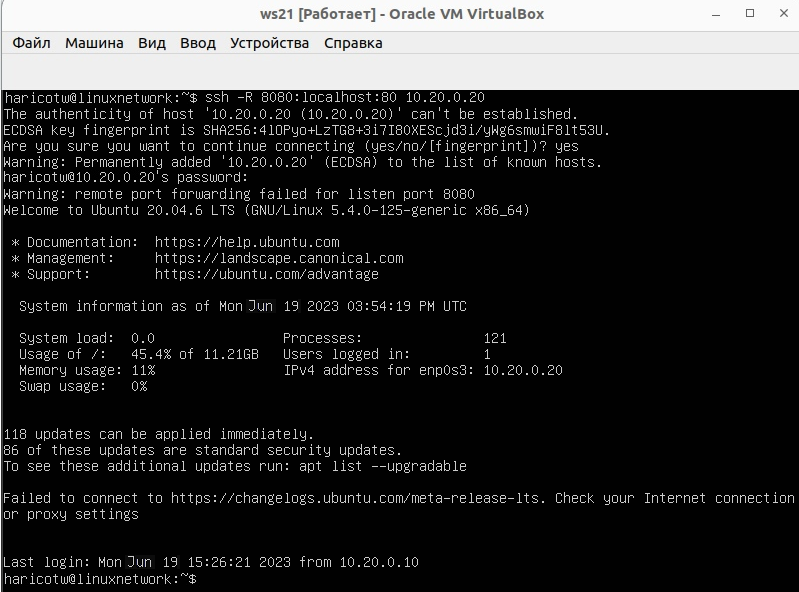

- Для проверки подключения перейдем во второй терминал и выполним команду: `telnet 127.0.0.1 [локальный порт]`

- Сохраним дампы образов виртуальных машин
